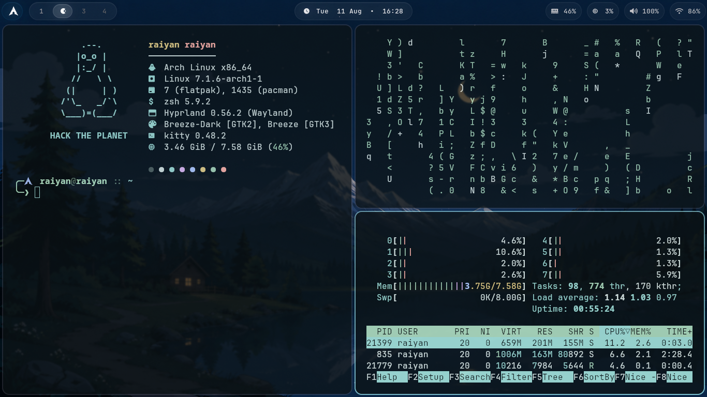
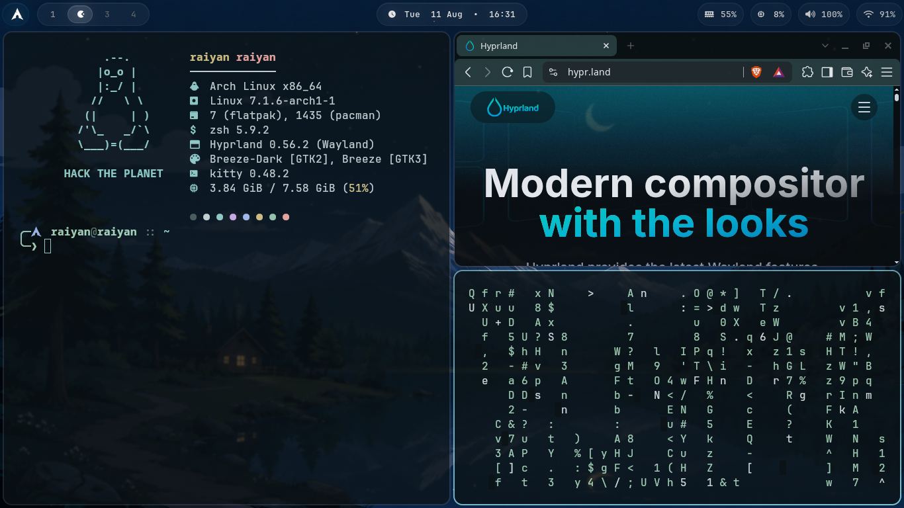
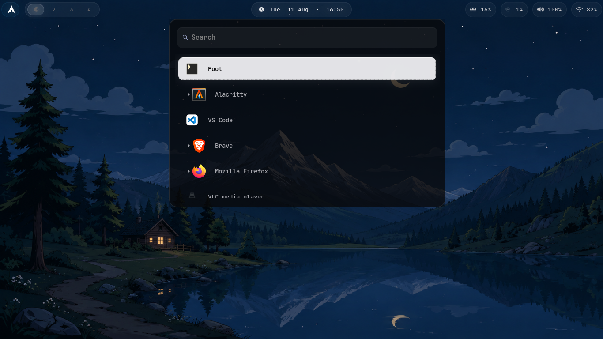

# 🖤 Arch Linux + Hyprland

A minimal, clean, and keyboard-driven **Arch Linux + Hyprland** setup.

Built for a lightweight Wayland desktop with the essentials for development, browsing, media, screenshots, wallpapers, and daily use.



## ✨ Features

- 🪟 **Hyprland** — Wayland compositor
- 📊 **Waybar** — Status bar
- 🚀 **Wofi** — Application launcher
- 💻 **Kitty** — Terminal
- 🌐 **Firefox** — Web browser
- 🖼️ **imv** — Image viewer
- 🔐 **Hyprlock** — Screen locker
- 😴 **Hypridle** — Idle management
- 🖼️ **Hyprpaper** — Wallpaper manager
- ⚡ **Fastfetch** — System information
- 🐚 **Zsh** — Shell
- 🌳 **Git** — Version control
- 🌐 **Curl** — Network utility

---

## 📸 Screenshots

### Desktop


### Applications



### Terminal



---

## 📦 Packages

```text
hyprland
waybar
wofi
kitty
imv
firefox
fastfetch
git
curl
zsh
hyprlock
hypridle
hyprpaper
dolphin
hyprshot
wl-clipboard
cliphist
pavucontrol
```

---

## 🚀 Installation

### 1. Update Arch

```bash
sudo pacman -Syu
```

### 2. Install packages

```bash
sudo pacman -S \
    hyprland \
    waybar \
    wofi \
    kitty \
    imv \
    firefox \
    fastfetch \
    git \
    curl \
    zsh \
    hyprlock \
    hypridle \
    hyprpaper \
    dolphin \
    hyprshot \
    wl-clipboard \
    cliphist \
    pavucontrol
```

---

## 📁 Dotfiles

The configuration files are stored inside `~/.config`.

```text
~/.config/
├── hypr/
│   ├── hyprland.conf
│   ├── hyprlock.conf
│   ├── hypridle.conf
│   └── hyprpaper.conf
│
├── waybar/
│   ├── config
│   └── style.css
│
├── wofi/
│   └── style.css
│
├── kitty/
│   └── kitty.conf
│
└── fastfetch/
    └── config.jsonc

~/.zshrc
```

---

## ⌨️ Keybindings

| Key                 | Action                |
| ------------------- | --------------------- |
| `SUPER + ENTER`     | Terminal              |
| `SUPER + B`         | Firefox               |
| `SUPER + E`         | File manager          |
| `SUPER + SPACE`     | App launcher          |
| `SUPER + A`         | Audio control         |
| `SUPER + Q`         | Close window          |
| `SUPER + F`         | Fullscreen            |
| `SUPER + V`         | Toggle floating       |
| `SUPER + S`         | Region screenshot     |
| `SUPER + SHIFT + S` | Fullscreen screenshot |
| `SUPER + L`         | Lock screen           |
| `SUPER + SHIFT + E` | Exit Hyprland         |

---

## 🖼️ Wallpapers

Place wallpapers in:

```text
~/Pictures/Wallpapers/
```

Example `hyprpaper.conf`:

```ini
preload = ~/Pictures/Wallpapers/wallpaper.jpg
wallpaper = ,~/Pictures/Wallpapers/wallpaper.jpg
splash = false
```

---

## 🐚 Zsh

Set Zsh as the default shell:

```bash
chsh -s /bin/zsh
```

Example `.zshrc`:

```zsh
export EDITOR=nvim

alias ll='ls -lah'
alias la='ls -A'
alias c='clear'
alias update='sudo pacman -Syu'

fastfetch
```

---

## 📋 Clipboard

Start clipboard history with:

```ini
exec-once = wl-paste --type text --watch cliphist store
exec-once = wl-paste --type image --watch cliphist store
```

---

## 📸 Screenshots

Using `hyprshot`:

```bash
hyprshot -m region
hyprshot -m window
hyprshot -m output
```

Example bindings:

```ini
bind = SUPER, S, exec, hyprshot -m region
bind = SUPER SHIFT, S, exec, hyprshot -m output
bind = SUPER CTRL, S, exec, hyprshot -m window
```

---

## 🔄 Reload Configuration

Reload Hyprland:

```bash
hyprctl reload
```

Restart Waybar:

```bash
killall waybar
waybar &
```

Restart Hyprpaper:

```bash
killall hyprpaper
hyprpaper &
```

---

## 🧪 Troubleshooting

Check the Wayland session:

```bash
echo $XDG_SESSION_TYPE
```

Expected:

```text
wayland
```

Check Hyprland:

```bash
hyprctl version
```

Check installed applications:

```bash
which hyprland
which waybar
which wofi
which kitty
which firefox
```

---

## 📂 Repository Structure

```text
arch-hyprland/
│
├── README.md
├── screenshots/
│   ├── s1.png
│   ├── s2.png
│   └── s3.png
│
├── hypr/
│   ├── hyprland.conf
│   ├── hyprlock.conf
│   ├── hypridle.conf
│   └── hyprpaper.conf
│
├── waybar/
│   ├── config
│   └── style.css
│
├── wofi/
│   └── style.css
│
├── kitty/
│   └── kitty.conf
│
├── fastfetch/
│   └── config.jsonc
│
└── zsh/
    └── .zshrc
```

---

## 🔗 Install Dotfiles

Clone the repository:

```bash
git clone YOUR_REPOSITORY_URL ~/dotfiles
cd ~/dotfiles
```

Back up your existing configuration first, then copy the files:

```bash
mkdir -p ~/.config

cp -r hypr ~/.config/
cp -r waybar ~/.config/
cp -r wofi ~/.config/
cp -r kitty ~/.config/
cp -r fastfetch ~/.config/

cp zsh/.zshrc ~/.zshrc
```

Restart Hyprland or reload the configuration.

---

## 🛠️ TODO

- [ ] Notification daemon
- [ ] Bluetooth support
- [ ] Network management
- [ ] Power menu
- [ ] Clipboard GUI
- [ ] Better Waybar modules
- [ ] Custom Wofi theme
- [ ] Screenshot clipboard support
- [ ] Installation script

---

## 🖤 Philosophy

```text
Minimal
Fast
Clean
Keyboard-driven
Dark
Wayland
Arch Linux
Hyprland
```

Every component is separate and replaceable. No heavy desktop environment — just the tools needed for a fast and comfortable workflow.

---

## 📜 License

Feel free to use, modify, and adapt this configuration for your own setup.

---

### 🖤 Built with

**Arch Linux + Hyprland + Waybar + Wofi + Kitty + Firefox + imv + Hyprlock + Hypridle + Hyprpaper + Zsh**
